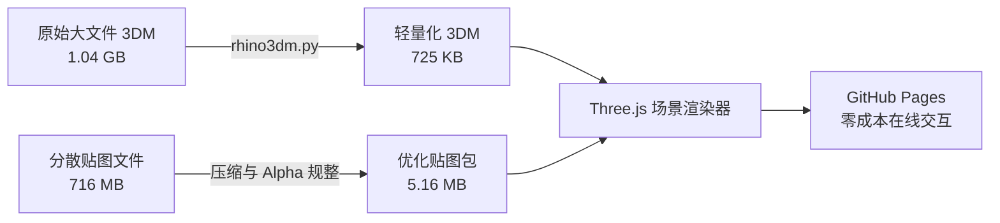

# 🏛️ 3D 美术馆在线交互审阅系统 (3D Gallery Web Viewer)

> 基于 **Rhino**、**rhino3dm (WebAssembly)** 与 **Three.js** 构建的轻量化 Web3D 实时审阅平台。  
> 实现大体量 CAD 展厅模型从 **1GB+** 到 **700KB** 的极速轻量化，贴图全量保真还原，支持免安装、全平台在线交互漫游。

---

[](https://jidanniwang.github.io/3d/)
[](https://jidanniwang.github.io/3d/)
[](https://threejs.org/)
[](https://github.com/mcneel/rhino3dm)

---

## 🌟 核心特性

- **极致轻量化**：通过 `rhino3dm` 提取原生渲染网格（Render Mesh），剔除冗余 NURBS 历史数据，模型由 1.04GB 精简至 **725 KB**（压缩比 > 99%）。
- **贴图无损与透明通道**：自动化搜集整理展品与展板贴图，人物立像完美支持 Alpha 透明通道（`alphaTest` 镂空），彻底杜绝黑边与丢失贴图问题。
- **全景 3D 交互与漫游**：
  - **键盘方向键 / WASD 漫游**：支持键盘 `↑ / ↓ / ← / →` 或 `W / A / S / D` 平滑前后左右移动镜头，按住 `Shift` 加速漫游，`Space / E` 垂直上升，`Q / C` 垂直下降。
  - **鼠标交互**：左键 360° 环视全景、右键平移、滚轮无级缩放。
  - **白天日光 / 黑夜展厅双模式**：左上角 `☀️ / 🌙` 一键切换，智能切换背景色、光照强度与磨砂玻璃 UI，支持本地偏好记忆。
  - **多作品时间轴 Dock 栏**：底部支持多模型平滑热切换，并支持拖拽任意 `.3dm` 即时全功能预览。
  - **图层与展品抽屉**：右侧抽屉式图层树控制（`👁️` 一键显隐）与展板画作快速定位。
  - **GitHub 双向同步删除与直传**：支持在网页端直接物理删除与提交 GitHub 仓库中的 3D 作品。

---

## 🏗️ 技术架构



1. **几何解析**：前端利用 `rhino3dm.wasm` 直接在浏览器沙箱内解析 `.3dm` 格式并生成 `THREE.BufferGeometry`。
2. **材质管线**：智能映射物理材质属性与相对路径贴图，动态绑定 Mesh 材质。
3. **渲染优化**：采用 `ACESFilmicToneMapping` 色调映射与精细级曝光平衡，确保展厅柔和明亮的漫反射艺术质感。

---

## 💻 本地运行

无需编译或配置复杂的 Node.js 环境，直接使用任何静态 HTTP 服务器：

```bash
# 使用 Python 启动静态服务器
python -m http.server 8080

# 打开浏览器访问
http://localhost:8080/
```

或在 VS Code / IDE 中直接右键 `index.html` 选择 **"Open with Live Server"**。

---

## 📂 目录说明

```text
├── index.html               # Web3D 交互主程序 (Three.js + rhino3dm.js)
├── gallery_optimized.3dm    # 优化后的超轻量 3D 展厅结构 (725 KB)
├── gallery_textures/        # 展板与画作材质贴图资源
└── README.md                # 项目文档与演示入口
```
